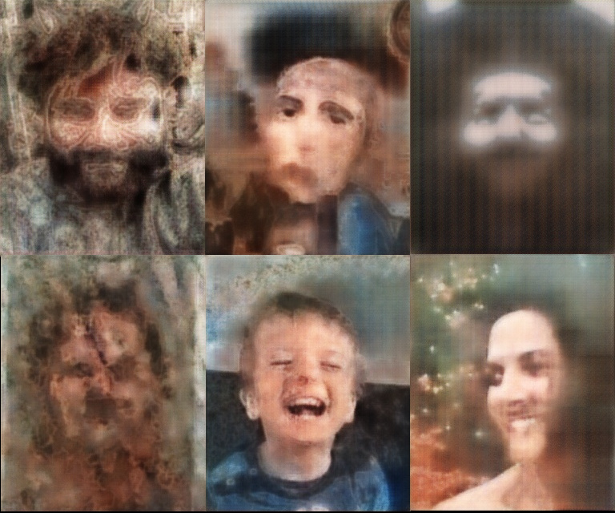
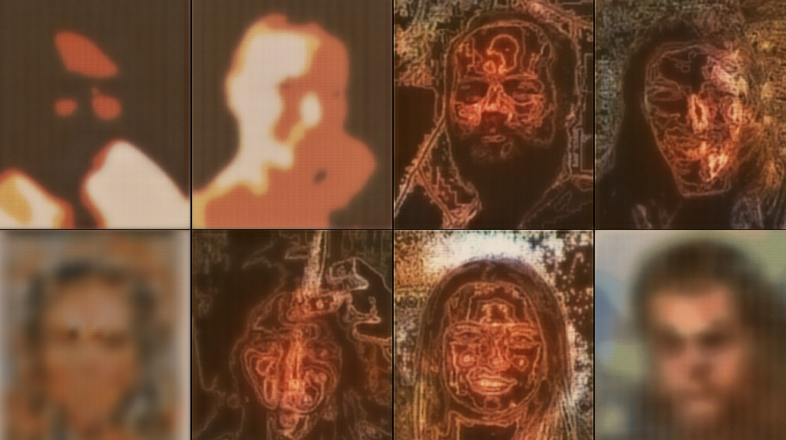
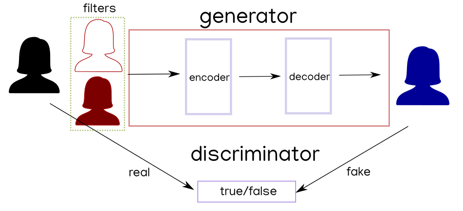

# ML paint

A model to build artistic effects with [pix2pix](https://learnopencv.com/paired-image-to-image-translation-pix2pix/). 

A [gallery](https://intertino.it/viaggi/p/ai_gen.hmtl)

A [documentation](https://intertino.it/spiega/generative.html)

